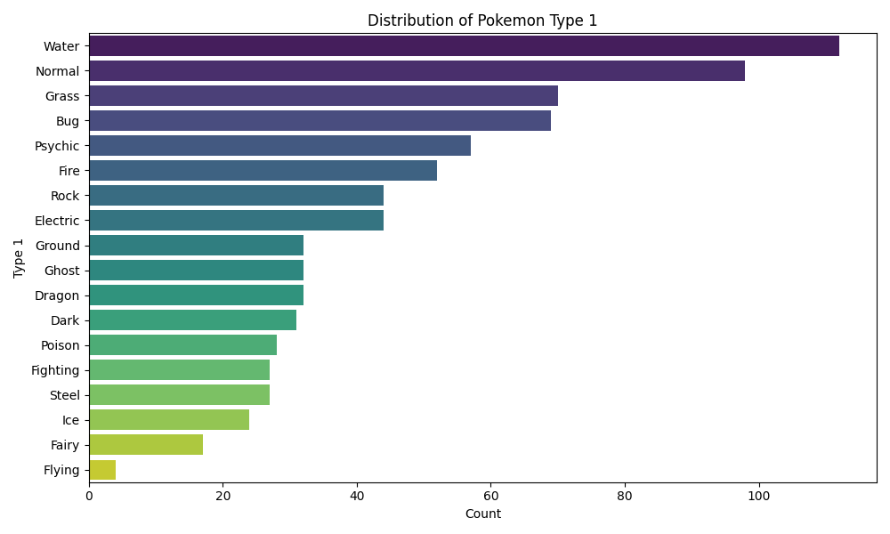
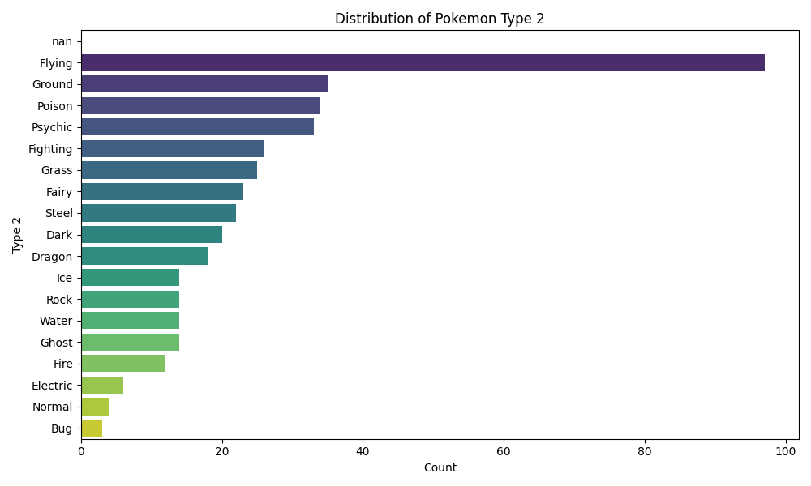
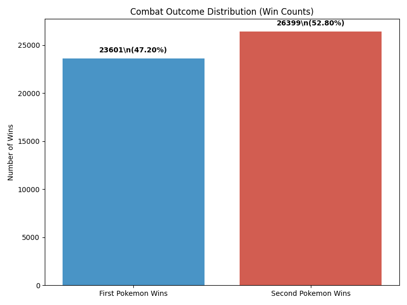
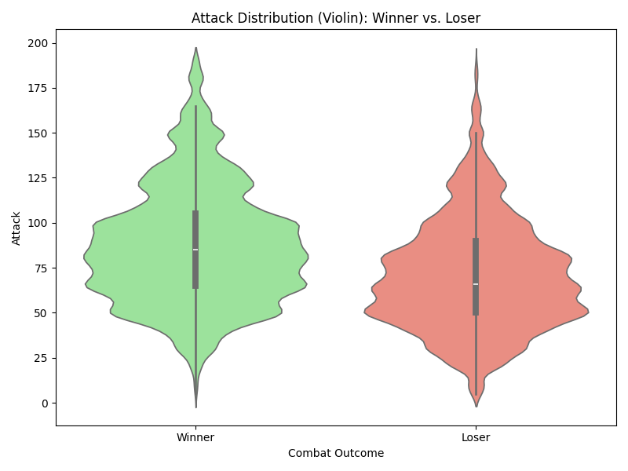

# Pokemon Data Analysis Report

This report details the analysis of the Pokemon dataset, covering descriptive statistics, missing data, target variable distributions, and a comparison of Pokemon features based on combat outcomes. All generated plots and summary CSV files are stored in the `analysis_report_plots/` directory.

## 1. Descriptive Statistics

### Numeric Attributes (`pokemon.csv`)
Descriptive statistics (mean, median, standard deviation, min, max, quartiles) for all numeric attributes in the `pokemon.csv` dataset were calculated.

- **Summary CSV:** `analysis_report_plots/pokemon_numeric_summary.csv`

Key numeric attributes include HP, Attack, Defense, Special Attack, Special Defense, Speed, Generation, and ID. While ID is an identifier and Generation is categorical, they were included as per the initial broad request for all numeric types.

### Nominal Attributes (`pokemon.csv`)
Frequency counts and percentages were calculated for nominal attributes: `Type 1`, `Type 2`, and `Legendary`.

- **`Type 1` Summary:**
    - **CSV:** `analysis_report_plots/pokemon_nominal_Type_1_summary.csv`
    - **Plot:**
        
        *This plot shows the distribution of primary Pokemon types. Water and Normal types are among the most common.*

- **`Type 2` Summary:**
    - **CSV:** `analysis_report_plots/pokemon_nominal_Type_2_summary.csv`
    - **Plot:**
        
        *This plot illustrates the distribution of secondary Pokemon types. A significant number of Pokemon do not have a secondary type (NaN).*

- **`Legendary` Status Summary:**
    - **CSV:** `analysis_report_plots/pokemon_nominal_Legendary_summary.csv`
    - **Plot:** (A more specific pie chart for Legendary distribution is in Section 3)
        
        *This bar chart shows the count of Legendary vs. Non-Legendary Pokemon.*

## 2. Missing Data Analysis

### `pokemon.csv`
Missing data was identified primarily in the `Type 2` column, where many Pokemon do not have a secondary type. A small number of `Name` entries were also found to be missing.

- **Summary CSV:** `analysis_report_plots/pokemon_missing_data_summary.csv`
- **Heatmap:**
    
    *The heatmap visually confirms that `Type 2` is the primary column with missing values.*

### `combats.csv`
No missing data was found in the `combats.csv` dataset.

- **Summary CSV:** `analysis_report_plots/combats_missing_data_summary.csv`

## 3. Target Analysis (Class Distribution)

### Combat Outcome Distribution (`combats.csv`)
The win rates for the first and second Pokemon in battles were analyzed.

- **Findings:**
    - Total Combats: 50,000
    - First Pokemon Wins: 23,601 (47.20%)
    - Second Pokemon Wins: 26,399 (52.80%)
- **Plot:**
    
    *The distribution is fairly balanced, with the second Pokemon having a slightly higher win rate.*

### Legendary Pokemon Distribution (`pokemon.csv`)
The distribution of Legendary vs. Non-Legendary Pokemon was examined.

- **Findings:**
    - Non-Legendary: 735 (91.875%)
    - Legendary: 65 (8.125%)
- **Summary CSV:** `analysis_report_plots/pokemon_legendary_distribution.csv`
- **Plot:**
    
    *As expected, Legendary Pokemon are rare, constituting a small fraction of the total.*

## 4. Comparison of Features based on Combat Outcome

The average stats of winning Pokemon were compared against those of losing Pokemon.

- **Summary CSV:** `analysis_report_plots/pokemon_winner_vs_loser_avg_stats.csv`

### Average Stats Comparison (Bar Plot)
- **Plot:**
    
    *This bar plot shows that, on average, winning Pokemon tend to have higher stats across all categories (HP, Attack, Defense, Sp. Atk, Sp. Def, Speed) compared to losing Pokemon.*

### Detailed Stat Distributions (Boxplots and Violin Plots)
For each primary stat, boxplots and violin plots were generated to compare the distributions between winning and losing Pokemon.

**Example: Attack**
- **Boxplot:**
    
- **Violin Plot:**
    

*Similar plots are available for HP, Defense, Sp. Atk, Sp. Def, and Speed in the `analysis_report_plots/` directory (e.g., `pokemon_HP_boxplot_winner_vs_loser.png`, `pokemon_Speed_violin_winner_vs_loser.png`). These plots consistently show that winners tend to have higher median stat values and distributions shifted towards higher values compared to losers.*

---

This concludes the comprehensive data analysis of the Pokemon datasets. The generated artifacts provide a clear overview of the data characteristics and relationships relevant to combat outcomes.
