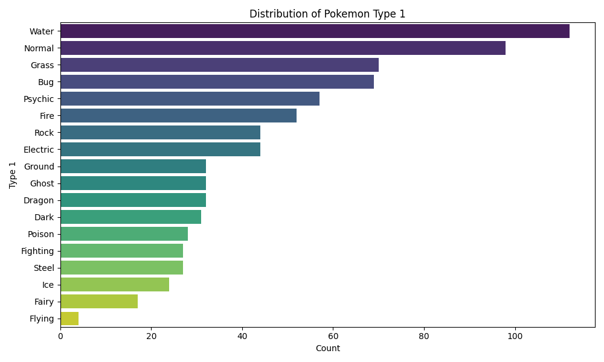
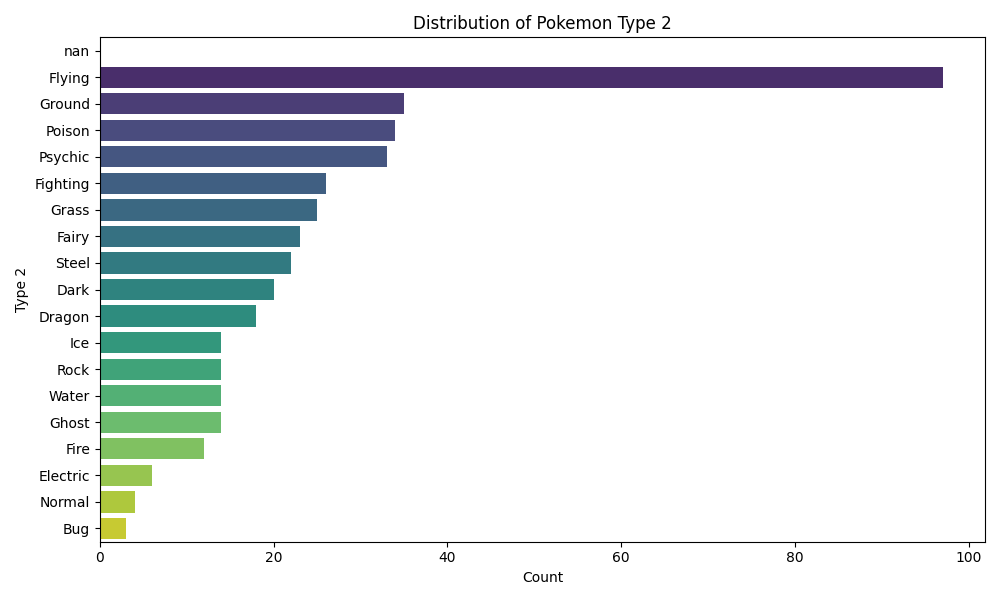
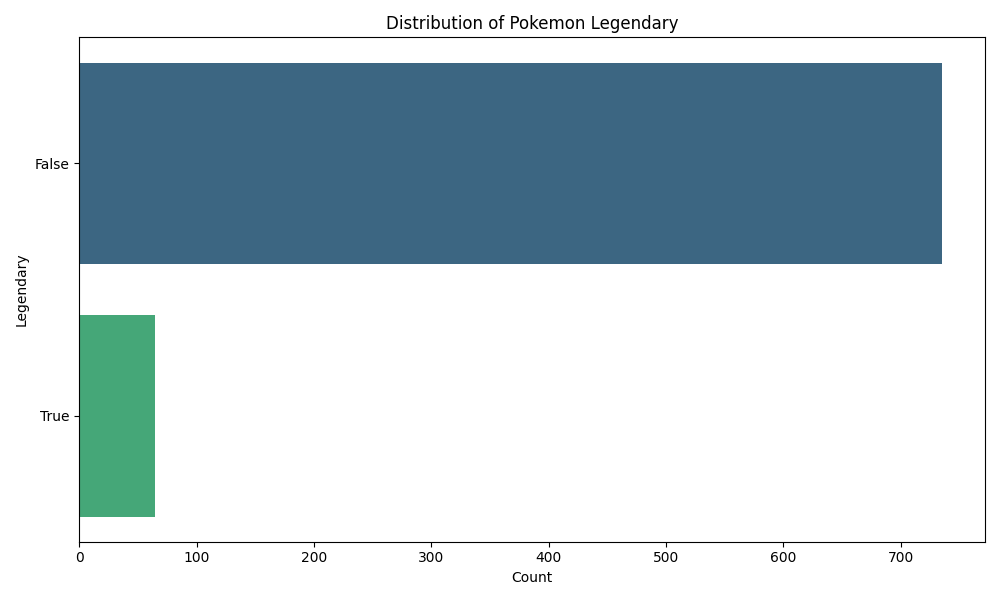
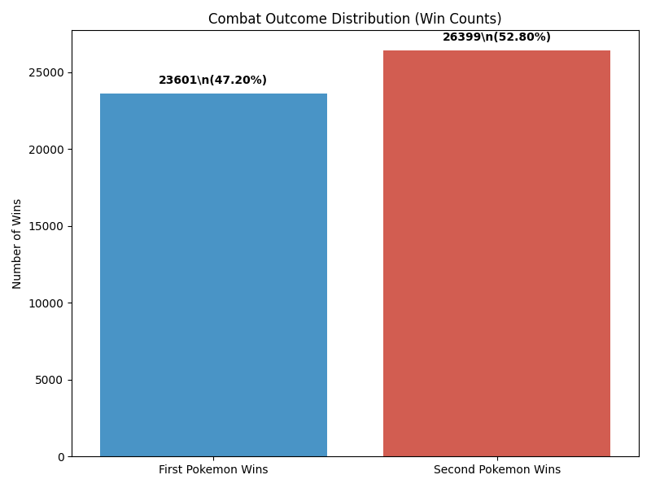
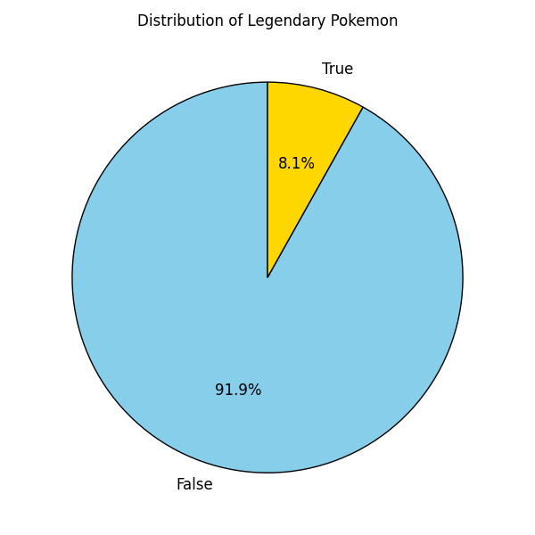
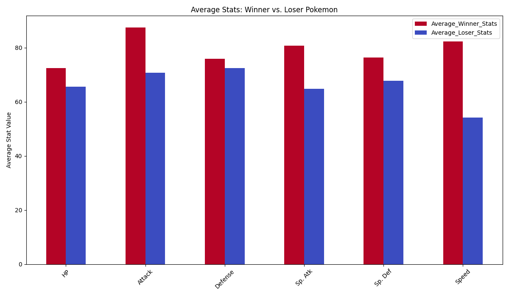
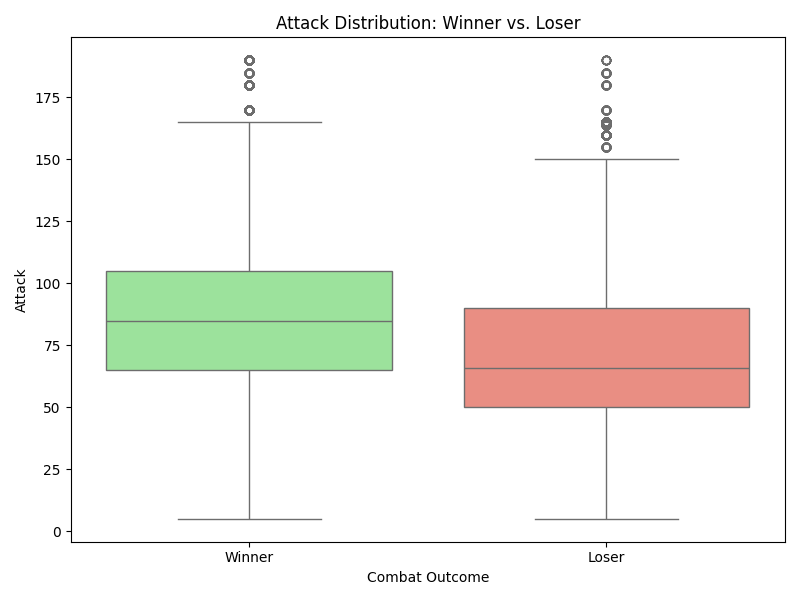
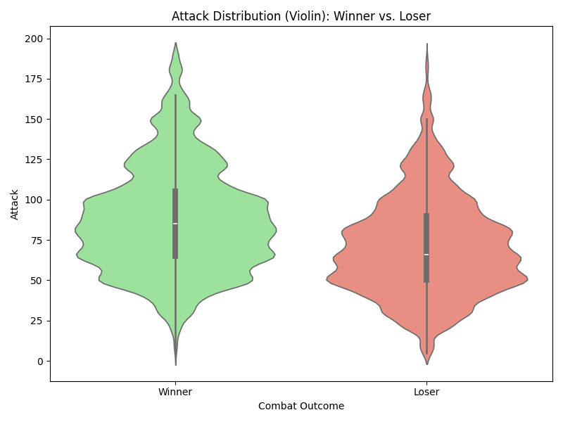

# Raport z Analizy Danych Pokemonów

Niniejszy raport szczegółowo opisuje analizę zbioru danych Pokemonów, obejmującą statystyki opisowe, brakujące dane, rozkłady zmiennych docelowych oraz porównanie cech Pokemonów na podstawie wyników walk. Wszystkie wygenerowane wykresy i pliki CSV z podsumowaniami są przechowywane w katalogu `analysis_report_plots/`.

## 1. Statystyki Opisowe

### Atrybuty Numeryczne (`pokemon.csv`)
Obliczono statystyki opisowe (średnia, mediana, odchylenie standardowe, minimum, maksimum, kwartyle) dla wszystkich atrybutów numerycznych w zbiorze danych `pokemon.csv`.

- **Plik CSV z podsumowaniem:** `analysis_report_plots/pokemon_numeric_summary.csv`

Kluczowe atrybuty numeryczne obejmują HP, Atak, Obrona, Atak Specjalny, Obrona Specjalna, Szybkość, Generacja i ID. Chociaż ID jest identyfikatorem, a Generacja jest kategoryczna, zostały one uwzględnione zgodnie z początkowym szerokim żądaniem dotyczącym wszystkich typów numerycznych.

### Atrybuty Nominalne (`pokemon.csv`)
Obliczono liczebności i wartości procentowe dla atrybutów nominalnych: `Type 1` (Typ 1), `Type 2` (Typ 2) i `Legendary` (Legendarny).

- **Podsumowanie `Type 1`:**
    - **CSV:** `analysis_report_plots/pokemon_nominal_Type_1_summary.csv`
    - **Wykres:**
        
        *Ten wykres pokazuje rozkład podstawowych typów Pokemonów. Typy Wodny i Normalny należą do najczęstszych.*

- **Podsumowanie `Type 2`:**
    - **CSV:** `analysis_report_plots/pokemon_nominal_Type_2_summary.csv`
    - **Wykres:**
        
        *Ten wykres ilustruje rozkład drugorzędnych typów Pokemonów. Znaczna liczba Pokemonów nie posiada drugorzędnego typu (NaN).*

- **Podsumowanie statusu `Legendary`:**
    - **CSV:** `analysis_report_plots/pokemon_nominal_Legendary_summary.csv`
    - **Wykres:** (Bardziej szczegółowy wykres kołowy dla rozkładu Legendarnych znajduje się w Sekcji 3)
        
        *Ten wykres słupkowy pokazuje liczbę Legendarnych Pokemonów w porównaniu do Nielendarnych.*

## 2. Analiza Brakujących Danych

### `pokemon.csv`
Brakujące dane zidentyfikowano głównie w kolumnie `Type 2`, gdzie wiele Pokemonów nie ma drugorzędnego typu. Stwierdzono również brak niewielkiej liczby wpisów w kolumnie `Name` (Nazwa).

- **Plik CSV z podsumowaniem:** `analysis_report_plots/pokemon_missing_data_summary.csv`
- **Mapa Ciepła:**
    
    *Mapa ciepła wizualnie potwierdza, że `Type 2` jest główną kolumną z brakującymi wartościami.*

### `combats.csv`
Nie znaleziono brakujących danych w zbiorze `combats.csv`.

- **Plik CSV z podsumowaniem:** `analysis_report_plots/combats_missing_data_summary.csv`

## 3. Analiza Zmiennej Docelowej (Rozkład Klas)

### Rozkład Wyników Walk (`combats.csv`)
Przeanalizowano wskaźniki zwycięstw dla pierwszego i drugiego Pokemona w walkach.

- **Wyniki:**
    - Całkowita liczba walk: 50 000
    - Zwycięstwa Pierwszego Pokemona: 23 601 (47,20%)
    - Zwycięstwa Drugiego Pokemona: 26 399 (52,80%)
- **Wykres:**
    
    *Rozkład jest dość zrównoważony, przy czym drugi Pokemon ma nieco wyższy wskaźnik zwycięstw.*

### Rozkład Legendarnych Pokemonów (`pokemon.csv`)
Zbadano rozkład Pokemonów Legendarnych w porównaniu do Nielendarnych.

- **Wyniki:**
    - Nielendarne: 735 (91,875%)
    - Legendarne: 65 (8,125%)
- **Plik CSV z podsumowaniem:** `analysis_report_plots/pokemon_legendary_distribution.csv`
- **Wykres:**
    
    *Zgodnie z oczekiwaniami, Legendarne Pokemony są rzadkie i stanowią niewielką część całości.*

## 4. Porównanie Cech na Podstawie Wyniku Walki

Porównano średnie statystyki wygrywających Pokemonów ze statystykami przegrywających.

- **Plik CSV z podsumowaniem:** `analysis_report_plots/pokemon_winner_vs_loser_avg_stats.csv`

### Porównanie Średnich Statystyk (Wykres Słupkowy)
- **Wykres:**
    
    *Ten wykres słupkowy pokazuje, że średnio wygrywające Pokemony mają zwykle wyższe statystyki we wszystkich kategoriach (HP, Atak, Obrona, Atak Specjalny, Obrona Specjalna, Szybkość) w porównaniu do przegrywających Pokemonów.*

### Szczegółowe Rozkłady Statystyk (Wykresy Pudełkowe i Skrzypcowe)
Dla każdej podstawowej statystyki wygenerowano wykresy pudełkowe i skrzypcowe w celu porównania rozkładów między wygrywającymi a przegrywającymi Pokemonami.

**Przykład: Atak**
- **Wykres Pudełkowy:**
    
- **Wykres Skrzypcowy:**
    

*Podobne wykresy są dostępne dla HP, Obrony, Ataku Specjalnego, Obrony Specjalnej i Szybkości w katalogu `analysis_report_plots/` (np. `pokemon_HP_boxplot_winner_vs_loser.png`, `pokemon_Speed_violin_winner_vs_loser.png`). Te wykresy konsekwentnie pokazują, że zwycięzcy mają zwykle wyższe mediany wartości statystyk, a ich rozkłady są przesunięte w kierunku wyższych wartości w porównaniu do przegranych.*

---

Na tym kończy się kompleksowa analiza danych Pokemonów. Wygenerowane artefakty zapewniają jasny przegląd charakterystyk danych i zależności istotnych dla wyników walk.
